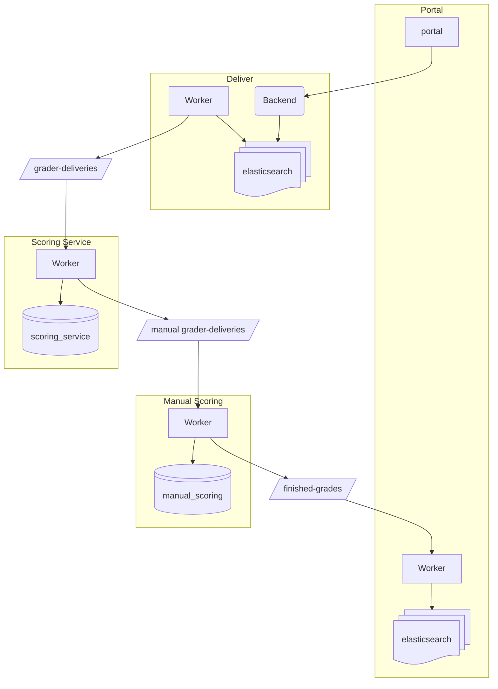

## Workflow

### Manual Scoring

```mermaid
flowchart TD

    portal --> tr
    subgraph "Deliver"
        tr(Backend) 
        tr-->trdb
        trworker[Worker] --> trdb@{ shape: docs, label: "elasticsearch"}
    end

    subgraph "Portal"
        portal
        poworker[Worker] -->
        podb@{ shape: docs, label: "elasticsearch"}

    end

    subgraph "Scoring Service"
        ssworker[Worker] -->
        ssdb@{ shape: lin-cyl, label: "scoring_service"}

    end

    subgraph "Manual Scoring"
        msworker[Worker] -->
        msdb@{ shape: lin-cyl, label: "manual_scoring"}

    end

    sstopic[/grader-deliveries/] --> ssworker -->
    mstopic[/manual grader-deliveries/] --> msworker -->

    msptopic[/finished-grades/] --> poworker
    trworker --> sstopic


```