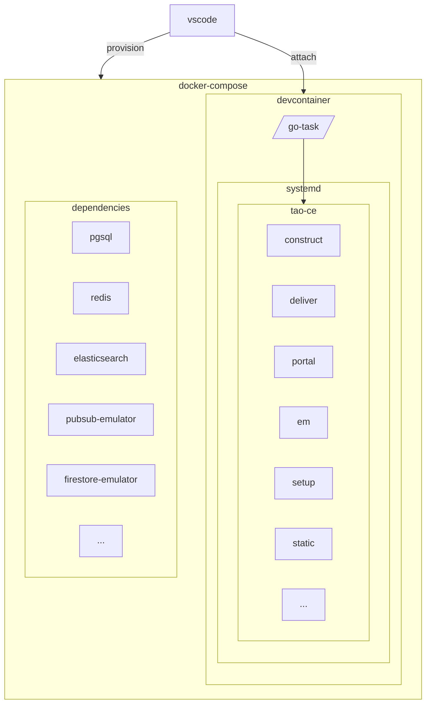

# Technical stack

## Overview

### Build & deployment toolchain

### Service deployment

## Repository structure

### `apps`

Each applications in apps contains:

* a `src` folder containing sources and/or submodules pointing to sources
* a `Dockerfile` to build each application
* a `meta` folder
  - a `systemd` directory containing services units to be deployed

### `build`

This folder contains building toolchain for each product, and their dependencies:

* `crystal`: the local deployment from sources 
* `swift`: the deployment through pre-built container
* `docs`: the present documentation toolchain

### `hack`

This folder contains some quick-win used in development. They should be removed soon or later and replaced by more suitable solution.

### `services`

Some external dependencies need to be built and run in order to have TAO Community working.

### `.devcontainer`

This container is used for active development to run all essential services.

### `etc` and `libexec`

Configuration and resources to be used for image building.

* `systemd`: common units for setup and static resources.
* `setup`: some `jsonnet` templates to generate applications config.
* `init`: initialization data.
* `pubsub`: Python script to provision PubSub topics and subscriptions.

## `Taskfile` workflow

[go-task](https://taskfile.dev/docs/guide) is used to organize appliation build and local deployement of the TAO Community ecosystem in devcontainer.

Once in `devcontainer` environment, running `task dev:up` will build all dependencies and start local application deployment.
