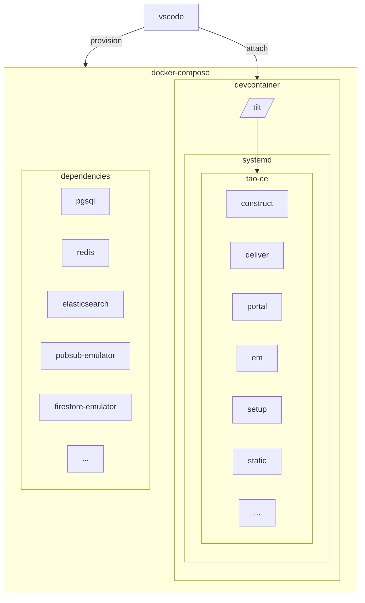
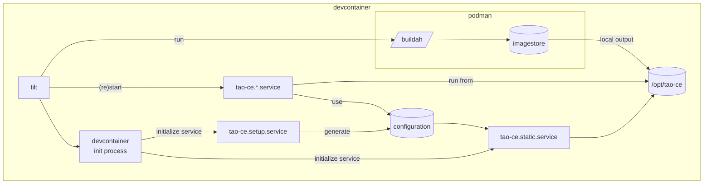

> [!NOTICE]
> This document is deprecated, new version to be published

# Overview

## Service deployment

## Build & deployment toolchain

# Components

## Dependencies

Those services are deployed from [`docker-compose.stack.yml`](/docker-compose.stack.yml) with pre-configuration of volumes to keep persistent data.

## Dev container

### podman

Podman is used to build images in isolated context, and can be used also to locally test images.

`buildah` is used as building frontend.

### tilt

Tilt is main entrypoint to build locally all the applications and run them in a Devcontainer.

### systemd

All applications are deployed through `systemd` units.