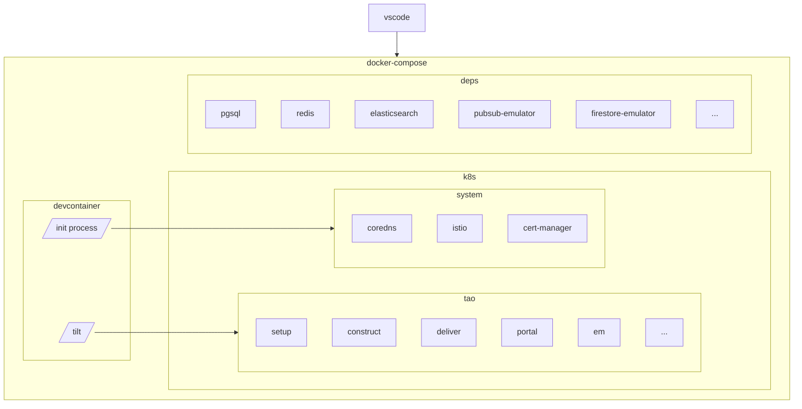
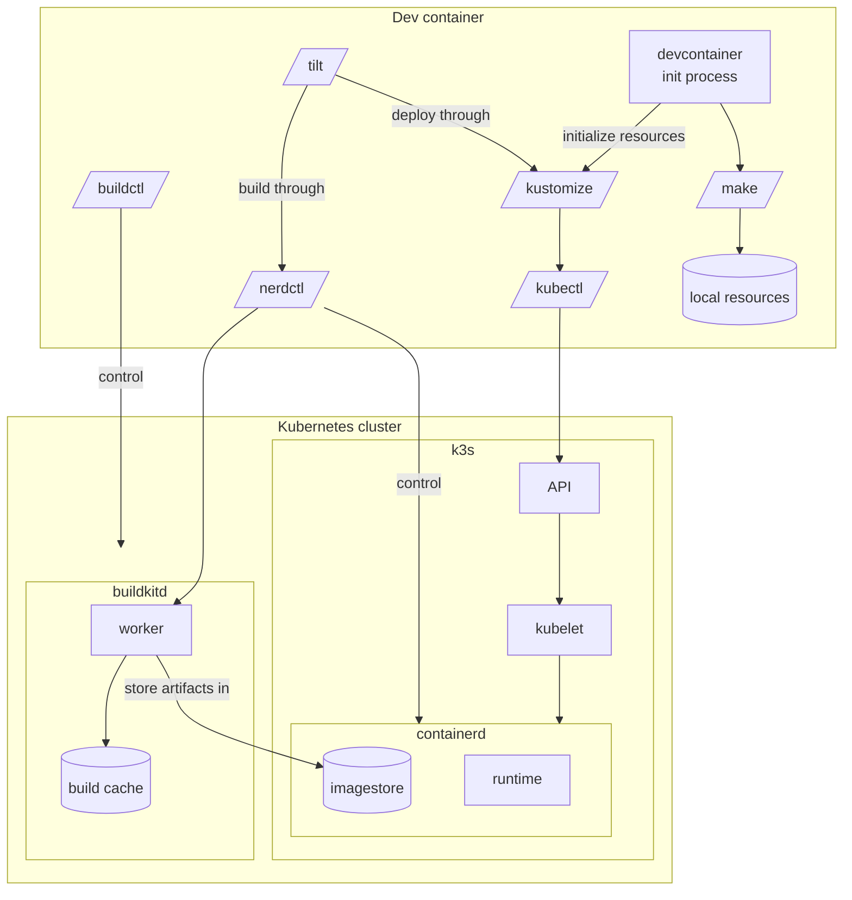

# Overview

## Service deployment

## Build & deployment toolchain

# Components

## Kubernetes cluster

### k3s

`k3s` is a light solution to deploy a complete Kubernetes cluster from a single binary. It is highly customizable to fit our development needs.

#### kubelet

Kubelet is the daemon responsible for container orchestration on each node of a Kubernetes server. It is automatically deployed and configure by `k3s`.

#### containerd

Containerd manage container runtime and storage. It is managed by kubelet for Kubernetes, but we can directly control it with `nerdctl` in `devcontainer` (`ctr` and `crictl` are other options, especially when we want to manage containers from `k3s` container itself).

### buildkitd

Buildkit is a daemon currently running as a sidecar of `k3s`, it may eventually be moved to a dedicated container in `docker-compose` manifest (however there are some frictions to fix related to cross-containers permissions).

Buildkit is managing building process (the same way it would on local `docker buildx` process), however, it is configured to store any artifacts into `k3s` `containerd` daemon.

This side-load dramatically improve building time, and using several flavors of cache (LLB, NPM, Composer, ...) it manages to rebuild and deploy artifacts in seconds.

## Dev container

### nerdctl

`nerdctl` is an alternative tool to manage `containerd`. It is mostly compatible with `docker` CLI syntax, and is able to manage additional features propose by `containerd` (like namespace).

In this toolchain, it is used by `tilt` to trigger builds in `buildkitd`, while passing some image references to benefit from layering and caching in `buildkitd` and `containerd`.

### buildctl

This command helps to manages `buildkitd`, and especially its cache, or to debug build processes.

### tilt

### kustomize

`kustomize` is the default scaffolding tool to build Kubernetes manifest. Even though it is pretty rigid compared to `jsonnet` ; it can be easily used without complex toolchain to deploy and embbed other manifests.

### init process

The initialization process of `devcontainer` is declared in `devcontainer.json` file. This process currently generate few local resource from a `Makefile` (especially for TLS), then deploy such resources in the Kubernetes cluster.

After a fresh install, we can find a Kubernetes cluster ready to use, with Ingress, DNS and certificates already provisionned.