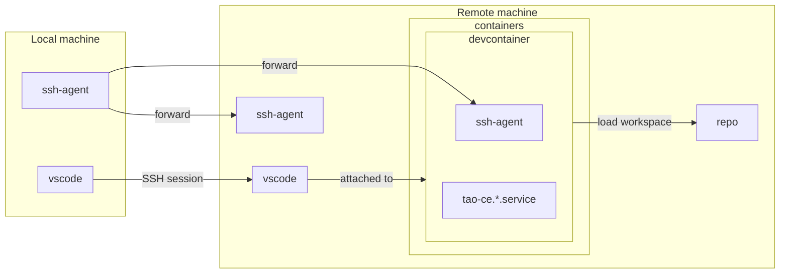

# Remote development environment

If your local machine is not matching hardware requirements, or if you are running an incompatible architecture or OS, you may run this development environment on a remote machine.



## Requirements

### Local machine
* SSH agent running on local machine
* [VSCode](https://code.visualstudio.com/docs/setup/setup-overview) need to be installed on your local machine
    * ensure to have [`Dev Containers`](https://marketplace.visualstudio.com/items?itemName=ms-vscode-remote.remote-containers) and [`Remote Explorer`](https://marketplace.visualstudio.com/items?itemName=ms-vscode.remote-explorer) extensions installed

### Remote machine
* at least 20GB of space disk available
* at least 4 CPUs `arm64` or `amd64`
* at least 8GB of RAM 
* SSH access using public key authentication
* Root privileges using `sudo` 
* Permissions to run containers (typically, add your remote user in `docker` group)
* `sysctl` records has the following value:
```bash
sudo sysctl -w net.ipv4.ip_unprivileged_port_start=0
```
## Prepare remote environment

### Fedora

```bash
sudo rpm --import https://packages.microsoft.com/keys/microsoft.asc
echo -e "[code]\nname=Visual Studio Code\nbaseurl=https://packages.microsoft.com/yumrepos/vscode\nenabled=1\nautorefresh=1\ntype=rpm-md\ngpgcheck=1\ngpgkey=https://packages.microsoft.com/keys/microsoft.asc" | sudo tee /etc/yum.repos.d/vscode.repo > /dev/null
sudo dnf install code docker-compose make patch qemu-img
```

### CoreOS

```bash
sudo rpm --import https://packages.microsoft.com/keys/microsoft.asc
echo -e "[code]\nname=Visual Studio Code\nbaseurl=https://packages.microsoft.com/yumrepos/vscode\nenabled=1\nautorefresh=1\ntype=rpm-md\ngpgcheck=1\ngpgkey=https://packages.microsoft.com/keys/microsoft.asc" | sudo tee /etc/yum.repos.d/vscode.repo > /dev/null
sudo rpm-ostree install code docker-compose make patch qemu-img
```

(You may have to restart remote machine after installing packages)


### Debian/Ubuntu

TODO

### ArchOS

TODO

## Start remote session

### Create SSH configuration

In `~/.ssh/config` file, add the following content (adapt content based on your environment):

```ini
Host tao-ce-remote-dev      # you may change this name
  HostName 111.222.333.444  # update with you remote hostname/IP
  User core                 # update with remote user
  Port 22                   # usually 22, but SSH may be running on another port
  ForwardAgent true         
  DynamicForward 17405
```

### Open session in Visual Studio Code

1. Open Visual Studio Code
2. In Command Palette (<kbd>Ctrl</kbd>+<kbd>Shift</kbd>+<kbd>P</kbd> ), select `Remote-SSH: Connect to host…`
3. Select SSH host, here `tao-ce-remote-dev`
4. You are now connect to a remote session on your remote machine.

### Continue with Development environment setup

Follow [`dev.md`](../dev.md) documentation to deploy code

### Connect to TAO Portal

You need either:
* to update local `/etc/hosts` file to have `community.tao.internal` redirected to your remote server IP
* or to use SOCKS5 proxy in your browser at `localhost`, port `17405`
    * you need also to add `127.0.0.1 community.tao.internal` in remote machine `/etc/hosts`
