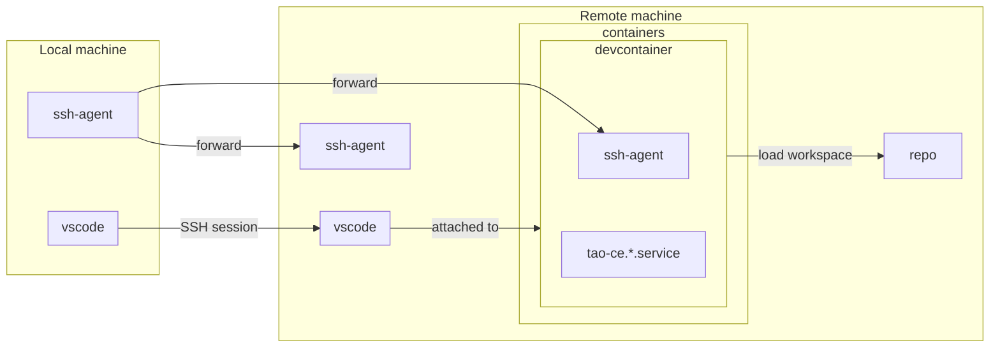

# Remote development environment

If your local machine is not matching hardware requirements, or if you are running an incompatible architecture or OS, you may run this development environment on a remote machine.



## Requirements

### Local machine
* SSH agent running on local machine
* [VSCode](https://code.visualstudio.com/docs/setup/setup-overview) need to be installed on your local machine
    * ensure to have [`Dev Containers`](https://marketplace.visualstudio.com/items?itemName=ms-vscode-remote.remote-containers) and [`Remote Explorer`](https://marketplace.visualstudio.com/items?itemName=ms-vscode.remote-explorer) extensions installed

### Remote machine
* at least 20GB of space disk available
* at least 4 CPUs `arm64` or `amd64`
* at least 8GB of RAM 
* SSH access using public key authentication
* Root privileges using `sudo` 
* Permissions to run containers (typically, add your remote user in `docker` group)

## Prepare remote environment

Any Linux distribution based on `systemd` and `cgroup` v2 (almost all modern distributions nowadays) may be used as remote development environment.

=== "Fedora"
    
    ```bash
    sudo rpm --import https://packages.microsoft.com/keys/microsoft.asc
    echo -e "[code]\nname=Visual Studio Code\nbaseurl=https://packages.microsoft.com/yumrepos/vscode\nenabled=1\nautorefresh=1\ntype=rpm-md\ngpgcheck=1\ngpgkey=https://packages.microsoft.com/keys/microsoft.asc" | sudo tee /etc/yum.repos.d/vscode.repo > /dev/null
    sudo dnf install code docker-compose make patch qemu-img
    ```
    

=== "CoreOS"
    
    ``` bash
    sudo rpm --import https://packages.microsoft.com/keys/microsoft.asc
    echo -e "[code]\nname=Visual Studio Code\nbaseurl=https://packages.microsoft.com/yumrepos/vscode\nenabled=1\nautorefresh=1\ntype=rpm-md\ngpgcheck=1\ngpgkey=https://packages.microsoft.com/keys/microsoft.asc" | sudo tee /etc/yum.repos.d/vscode.repo > /dev/null
    sudo rpm-ostree install code docker-compose make patch qemu-img
    ```
    
    CoreOS being an immutable system, you will have to reboot your remote environment to continue.
    
    ``` bash
    sudo systemctl reboot
    ```


=== "Debian/Ubuntu"

    TODO

=== "ArchOS"

    TODO

## Start remote session

### Create SSH configuration

In `~/.ssh/config` file, add the following content (adapt content based on your environment):

```
Host tao-ce-remote-dev      # you may change this name
  HostName 198.51.100.47    # update with you remote hostname/IP
  User core                 # update with remote user
  Port 22                   # usually 22, but SSH may be running on another port
  ForwardAgent true         # forward SSH agent
```


### Open session in Visual Studio Code

1. Open Visual Studio Code
2. In Command Palette (<kbd>Ctrl</kbd>+<kbd>Shift</kbd>+<kbd>P</kbd> ), select `Remote-SSH: Connect to host…`
3. Select SSH host, here `tao-ce-remote-dev`
4. You are now connect to a remote session on your remote machine.

For more documentation related to remote environment in Visual Studio Code, you can check [its manual](https://code.visualstudio.com/docs/remote/).

## What's next?

You have now a remote development environment ready to start `devcontainer` to build and run *TAO Community Edition*.


- [x] To continue, you can follow [Development Guide](./index.md).
- [x] Once `devcontainer` has been deployed, you can use Visual Studio Code to [forward port](https://code.visualstudio.com/docs/remote/ssh#_forwarding-a-port-creating-ssh-tunnel) to access remote *TAO Community Edition* as a local service.
    - You can check [this snippet](./snippets.md#redirect-port) to redirect port.

 


