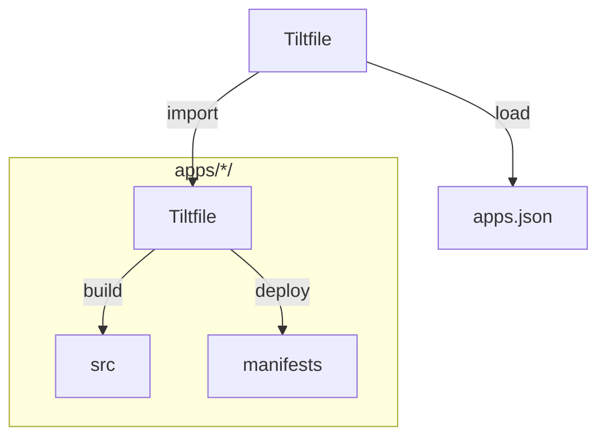

# `tao-ce` repository

## Repository structure

### [`apps`](/apps)

Each applications in apps contains:
* a `src` folder containing sources and/or submodules pointing to sources
* a `manifests` folder with a set of resources to deploy in Kubernetes
* a `Tiltfile` to load the application in Tilt
* eventually some `Dockerfile` for custom build (`Dockerfile` in `src` may use non-opensource base image or may rely on harden services which we would not consider at that time for opensource).

### [`manifests`](/manifests)

At root of the repository, a `manifests` folder list all apps application and redefine their images references to use `quay.io`.

In [`manifests/profiles`](/manifests/profiles), some preset of manifests are proposed:
* [`all`](/manifests/profiles/all) to deploy all applications
* [`core`](/manifests/profiles/core) to deploy a similar experience to TAO Core
* [`minimal`](/manifests/profiles/minimal) to deploy the strict minimum services set
* [`vm`](/manifests/profiles/vm) to deploy `all` profile in an isolated VM

### [`build`](/build)

This folder contains building toolchain for each product, and their dependencies:
* [`crystal`](/build/crystal/): the local deployment from sources 
* [`swift`](/build/swift/): the deployment through pre-built containers on local Kubernetes
* [`cozy`](/build/cozy/): the Virtual Machine deployment 

### [`hack`](/hack)

This folder contains some quick-win used in development. They should be removed soon or later and replaced by more suitable solution.

### [`services`](/services/)

Some external dependencies need to be built and run in order to have TAO Community working.

### [`.devcontainer`](/.devcontainer/)

This container is used for active development to run all essential services.

This devcontainers is using the following files also to perform development environment deployment:
* [`docker-compose.yml`](/docker-compose.yml): main entry point for `docker compose` during deployment
* [`docker-compose.stack.yml`](/docker-compose.stack.yml): list of dependencies services to be deployed for development
* [`docker-compose.config.yml`](/docker-compose.config.yml): some configuration for development environment

## `Tiltfile` workflow

[Tilt](https://tilt.dev/) is used to build and run locally the TAO Community ecosystem.

The [`Tiltfile`](/Tiltfile) file at root of the repo is loading applications `Tiltfile` based on [`apps.json`](/apps.json) file.

Once in `devcontainer` environment, running `tilt up` will load all `Tiltfile` and start local application deployment.

## `Makefile`

Some process are structured in `Makefile` to ease long process:
* `tls`: some tasks for certificate generation/signing
* `cozy`: generate `qcow2` image for Cozy
    * `cozy-run`: run `qcow2` image in a QEmu image
    * `cozy-pack`: create an `.ova` Virtual Machine appliance archive
* `swift`: some tasks to build/publish images
* `sbom`: generate Software Bill of Materials reports based on built artifacts
    * `sbom-local`: generate reports based on images built in `containerd`

