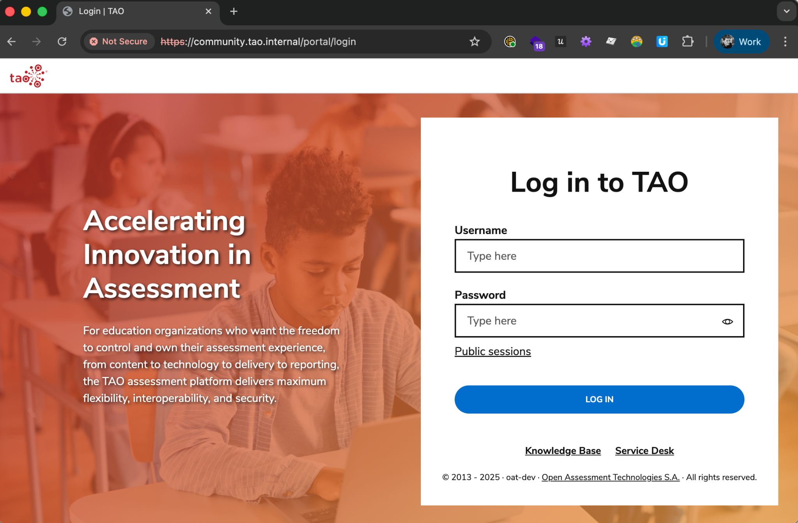

# First steps

## Login

!!! danger inline end "About default credentials"
    Considering the default password is particulary weak, you are expected to change it for all default accounts.

Open your browser and go to [`https://community.tao.internal/`](https://community.tao.internal/).

{width="400"}

Default credentials for Administrator account are:

* username: `admin`
* password: `password`

## Change password

!!! abstract inline end "About secure password"
    
    Password must contain:

     * at least 8 characters
     * at least one lowercase
     * at least one uppercase
     * at least one number or symbol

### From user profile

Once logged in in *TAO Community Edition*, any user can change their password in their account page.

1. Click on user avatar in the top right of the screen
2. Under `My account` section, click `My user`
3. Click on `Change password`
4. Choose a secure password
5. Click on `Save changes`.

### For other user, as administrator

An administrator can change passwords for other users.

1. In *TAO Community Edition* main menu, click `Users`
2. Locate user you want to update, click on :material-menu: icon, then `Edit`
3. Click on `Change password`
4. Choose a secure password, then click on `Save changes`.

## Create your first test session

### Prepare content

1. in *TAO Community Edition* main menu, click `Content bank`
2. Create new [`Items`](https://userguide.taotesting.com/user-documentation/latest/public/creating-a-test-item) and [`Tests`](https://userguide.taotesting.com/user-documentation/latest/public/creating-a-test) as described in [User guide](https://userguide.taotesting.com/).
3. Click on a test, then click on [`Publish`](https://userguide.taotesting.com/user-documentation/latest/public/publishing-a-test) to get it ready for a new session.

### Prepare users and groups

!!! example inline end "Demo users"

    By default, few users are already created, so you can skip user creation. 
    
    Their usernames are `demo01` up to `demo05`, with password `password`. 

1. in *TAO Community Edition* main menu, click `Users`
2. click on `Create user`
3. Fill required fields and submit. You can repeat this step to create as much users you need
4. in main menu, click on `Groups`
5. click on `Create group`, and fill required fields
6. click on `Users` subtab, and select users you want to add to this group. You can assign them a role (default is `Test-takers`)
7. Save the group

### Create a test session

A session assign a Delivery (a published test), to a group of users (the test-takers). Once the session is created, a user will be able to log in and pass the test.

1. in *TAO Community Edition* main menu, click `Sessions`
2. click on `Create session`, and fill required fields
3. Save the session

You can create multiple sessions for a group of users, they will be able to select the test they want to pass in their main menu after log in.

You can read more information about sessions in the [user guide](https://userguide.taotesting.com/user-documentation/latest/public/sessions-management).

## Pass a test

Finally, you can enjoy the test-taker experience in *TAO Community Edition*.

1. If you are still logged in with an administrator account, log out in your account menu
2. In log in page, enter test-taker username and password and submit
3. Select an assigned session and click `Start`

- [x] You can now pass your test, Good luck! :four_leaf_clover:

## Get test results

1. Re-open a session as administrator
2. in *TAO Community Edition* main menu, click `Sessions`
3. Find your session and click `Enter session`
4. Find a completed session from test-takers list, and click `Review test` to see results.

