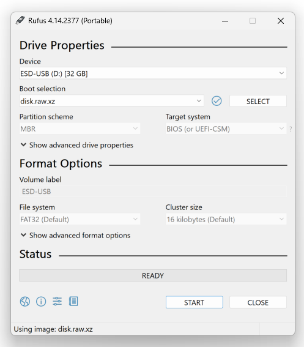

# Deploy on Raspberry Pi

!!! danger "About Raspberry Pi support"

    Support of Raspberry Pi is experimental, and requires destructive operations. 
    
    The following guide has only been tested on Raspberry Pi 4 8GB. Support for Raspberry Pi 5 has not been tested and is not planned.

    Also, ensure to check [limitations](#limitations) described below.


!!! abstract inline end "About this guide"
    In this guide, we will explain how to download and start an Appliance to run TAO Community Edition on Raspberry Pi 4.


## Requirements

To achieve this deployment, we will need:

* [x] a Raspberry Pi 4, with at least 8GB of RAM
    - an appropriate USB-C power supply 5V ≥2A
    - (optional) an USB keyboard, and a HDMI screen with micro HDMI cable
* [x] a microSD card, at least 64GB, and supporting class U1 or higher
* [x] a microSD reader
* [x] reliable Ethernet network, with high-speed Internet connection
    - while Appliance can be used offline, first start will require to download 3GB of data
    - ensure Raspberry Pi is connected to same LAN, and this network support DHCP
* [x] a computer running recent OS

    === "On Linux"
        - `sudo` privileges to write on device
        - `dd` and `xzcat` commands are available[^2]
        
        [^2]: they are part of Linux standard commands of major distributions

    === "On Windows"
        - administrative permissions to write on device
        - image etcher tool (e.g. [Rufus](https://rufus.ie))
        - compression software supporting `xz` format (e.g. [7-Zip](https://www.7-zip.org/))

## Download Appliance image

From your computer, browse release link of [`tao-ce/cozy`](https://github.com/tao-ce/cozy/releases), and look for `tao-ce-cozy-rpi4-server.ova` file.

Latest image can be directly downloaded [here](https://github.com/tao-ce/cozy/releases/latest/download/tao-ce-cozy-rpi4-server.ova).


## Etch microSD card 

We will now load this image on your microSD card.

!!! danger inline end "Risk of data loss"
    Please note this operation will completly remove all data on microSD card.
    
    Also, depending on your system, pay attention to carefully identify target device, to avoid damaging other storage on your computer.

=== "On Linux"
    1. First, plug microSD reader with the card in it. Your system may prompt to mount and explore it. Ignore it.
    2. Ensure to identify your microSD drive, exemple with `lsblk`, we can find it is called `/dev/mmcblk0` on this computer.
    ```bash
    lsblk -pd \
      -o NAME,SIZE,VENDOR,STATE,MODEL,SERIAL \
      --filter 'TYPE=="disk" and HOTPLUG==1'
    # NAME          SIZE VENDOR STATE MODEL SERIAL
    # /dev/mmcblk0 58.2G                    0x000006fd
    ```
    3. Find `disk.raw.xz` image and run the following command (ensure to change paths to match your device):
    ```bash
    IMAGE_PATH=path/to/disk.raw.xz #(1)
    SD_DEVICE=/dev/mmcblk0 #(2)
    xzcat $IMAGE_PATH \
        | sudo dd \
            of=${SD_DEVICE} \
            status=progress \
            oflag=direct \
            iflag=fullblock \
            bs=1M
    ```
        1. path to `disk.raw.xz` file
        2. microSD card device path identified in previous command

=== "On Windows"
    

    1. First, plug microSD reader with the card in it. Your system may prompt to mount and explore it. Ignore it.
    2. Open your image etcher tool (e.g. Rufus)
    3. In `Device`, look for the microSD card
    4. In `Boot selection`, choose `Disk or ISO image`
    5. Click on `SELECT` button, and open `disk.raw.xz`
    6. Click `START` to proceed.

Depending on your hardware, this operation can take 5 to 30 minutes.

Once done, ensure to unmount your microSD, and unplug it.

## Start Raspberry Pi 4 with Appliance image


Now that the image has been copied on microSD card, you can insert it in Raspberry Pi 4.

1. (Optional) If you have keyboard and screen, you may plug them to Raspberry Pi 4.

2. Prepare USB power supply, and plug it.

3. In few minutes, you should see green LED next to microSD socket blinking.


## Setup Appliance at first boot

??? info inline end "About this wizard"

    This wizard will help you to configure basic settings at a early stage of deployment, as TAO Community Edition is not yet starting.

    For more settings, you will be able to access Cockpit on [`https://tao-community-edition.local:9090`](https://tao-community-edition.local:9090) after system is started.


On first boot, you will notice a prompt to proceed to appliance setup.


=== "Continue with default settings"
    ??? note inline end "About TAO CE address"
        Note the address is different than usual container deployment (`community.tao.internal`), as we rely on mDNS protocol (which require `.local` domain) to propagate appliance address on your network.
   
    If left unattended, TAO Community Edition will be deployed with default settings:
    
    * language: English (US)
    * timezone: UTC
    * hostname: `tao-community-edition.local` (with mDNS broadcast)
    * TAO Community Edition flavor: Full
    * Hotspot:
        - enabled by default
        - SSID: `TAO Community Edition`
        - password: `ChangeMeNow`
    
=== "Customize settings"
    !!! info "About TAO CE address"
        If you choose a custom address, ensure to replace `tao-community-edition.local` while reading this guide.

    !!! example inline end "Under development"
        TAO Community Edition flavor are still in development, this settings will not have effect yet (Full flavor will be deployed).

    Follow the instructions to change the following settings:

    * language
    * timezone
    * hostname (with or without mDNS broadcast)
        - if you choose to use mDNS broadcast, ensure hostname is ending with `.local`
    * TAO Community Edition flavor:
        - `Full`: Complete version of TAO Community Edition, including portal, Delivery, Backoffice, Grader and Proctoring 
        - `Essential`: A complete environment for authoring and delivery, without Grader neither Proctoring
        - `Lite`: A subset of TAO Community Edition to run deliveries through Portal
        - `Minimal`: A version focused on LTI capabilities to perform assessment without Portal

Once submitted, Appliance will start downloading TAO Community Edition.

!!! notes "Long process"
    Depending on your hardware, it can takes from 20 minutes to 2 hours before TAO Community Edition is ready to be used.

    ??? question "Why is it so long?"
        To accelerate image build process, download and copy on microSD, appliance image will not contain TAO Community Edition neither its dependencies.

        At first boot, the appliance will download container images (~3GB) and uncompress them. TAO Community Edition container image is particulary long to uncompress, as it contains hundreds of thousands of files. Future versions may improve this behavior later.

        This will also ensure you are deploying the latest version of TAO Community Edition.


## Access Administrative console

!!! danger inline end "Change password"
    Whenever you can, log in on local/SSH/web console to change default password.


During installation process, you may access SSH console, or Cockpit[^1] web console.

=== "Web console (Cockpit)"
    1. Open a browser, and go to [`https://tao-community-edition.local:9090`](https://tao-community-edition.local:9090)
    2. You may face a Certificate warning, add this site in exceptions
    3. login with `tao` username and `tao` password

=== "SSH console"
    1. Open a terminal, and run the following command:
    ```bash
    ssh tao@tao-community-edition.local
    ```
    2. login with `tao` username and `tao` password

=== "Local console"
    1. connect a screen and a keyboard to Raspberry Pi
    2. find a console (TTY) with `Alt` + `F1` (to `F4`)
    3. login with `tao` username and `tao` password.


[^1]: Read [Cockpit documentation](https://cockpit-project.org/documentation.html) to administrate your appliance

## Access TAO Community Edition

!!! example "Readiness status"
    Current version is missing a proper Readiness feedback to let the user know when TAO Community Edition is ready. This feature is under active development and should be released soon.

Once ready, you should be able to connect to [`https://tao-community-edition.local`](https://tao-community-edition.local). 

## Limitations

Hardware specs of Raspberry Pi 4 implies limitations which may impact your experience with TAO Community Edition.

??? warning "No Real-Time Clock"

    Raspberry Pi has no [Real-Time Clock](https://en.wikipedia.org/wiki/Real-time_clock), therefore date/time may need to sync at every startup.
    Appliance image will automatically attempt to sync using [NTP](https://en.wikipedia.org/wiki/Network_Time_Protocol) at startup, however it will not work in offline conditions.

    Significant clock difference between Raspberry Pi and client machines may prevent users to access TAO Community Edition, and may affect test consistency.

    To adjust date/time:

    === "Using web console"
        1. Open [`https://tao-community-edition.local:9090`](https://tao-community-edition.local:9090), and log in.
        2. Click on `Overview` in side menu.
        3. Ensure you get `Administrative access`. If needed, click on `Turn on administrative access` in the yellow banner.
        4. Then in `Configuration` section, click on current time, next to `System time`.
        5. Adjust date/time, and click `Change`.

    === "Using terminal"
        1. Open SSH/local session with `tao` user.
        2. Run the following command (date format is `YYYY-mm-ddTHH:MM:SS`, e.g. `2024-12-25T19:00:00`):
        ```bash
        sudo date -s 2024-12-25T19:00:00
        ```

??? warning "Performances"

    TAO Community Edition on Raspberry Pi 4 would support up to 50 concurrent test-takers, with significant delay between test items (up to 10 seconds).

    Performances are directly impacted by microSD throughtput (max. 30MB/s for class U1) and limited speed of Raspberry Pi CPU (up to 1.8GHz). Overclocking has not been investigated, and is not recommended.

    You can use `btop` on terminal to get performance metrics.


??? warning "Power supply stability"

    Raspberry Pi relies on USB power and has no feature to address power supply inconsistency. Therefore, any operation on power supply may cause a power loss and a hard-reset of Raspberry Pi, which may imply data corruption.

    While a powerbank can be used to fully power a Raspberry Pi for days, any operation on power supply will interrupt USB power distribution. Ensure to properly shutdown Raspberry Pi before any operation on power supply.

    Based on our measures during TAO Community Edition benchmarks, Raspberry Pi uses 3W (with peaks up to 6W). A generic 5000mAh powerbank will last up to 5 hours.

??? warning "Start delay"

    While first boot delay is expected due to download and installation operations, Raspberry Pi may takes up to 10 minutes to start properly.

    There is currently no easy solution to check for readiness, but we are currently working on it.

## What's next?

- [x] You may now follow TAO Community Edition [first steps](../../first.md) and [user guide](https://userguide.taotesting.com/).
