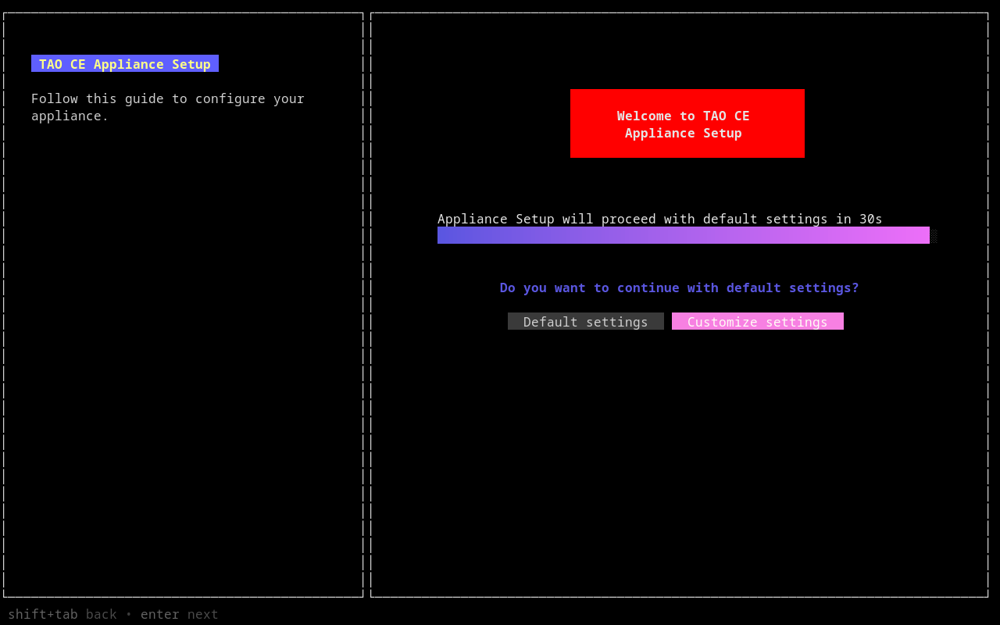

# Deploy on Virtual Machine


!!! abstract  "About this guide"
    In this guide, we will explain how to download and start an Appliance Virtual Machine to run TAO Community Edition.

## Requirements

To achieve this deployment, we will need:

!!! warning inline end "About `arm64` architecture"
    Virtual Machine deployment is not available yet on `arm64` architecture.

* [x] an `x86_84` host machine, able to allocate at least 8GB of RAM and 4 vCPUs
* [x] at least 40GB of available space disk (prefarbly on high-speed storage)
* [x] a reliable network, with high-speed Internet connection
    - while Appliance can be used offline, first start will require to download 3GB of data
    - ensure your network is allowing unregistered devices
* [x] [Oracle VirtualBox](https://www.virtualbox.org/) 7.2 (or later)

## Download Appliance image

From your computer, browse release link of [`tao-ce/cozy`](https://github.com/tao-ce/cozy/releases), and look for `tao-ce-cozy-vm-server.ova` file.

Latest image can be directly downloaded [here](https://github.com/tao-ce/cozy/releases/latest/download/tao-ce-cozy-vm-server.ova).

## Load Appliance in VirtualBox

Once downloaded:

1. Open VirtualBox.
2. In main menu, click `File` > `Import Appliance…`.
3. In `Import Virtual Appliance` wizard, choose `Local File System`, then click on browse icon, and select downloaded image.
4. In `Settings`, you can check parameters (in particular CPU/RAM allocation). Click `Finish` button to proceed with import.
5. Once imported, right-click on the virtual machine, then `Settings…`
6. In `Expert` settings, go to `Network`, and check for `Adapter 1`. Ensure it is attached to `Bridge Adapter`, and that the interface name match your main network interface.
7. Click `OK`, then you can `Start` the virtual machine.

## Setup Appliance at first boot

??? info inline end "About this wizard"

    This wizard will help you to configure basic settings at a early stage of deployment, as TAO Community Edition is not yet starting.

    For more settings, you will be able to access Cockpit on [`https://tao-community-edition.local:9090`](https://tao-community-edition.local:9090) after system is started.


On first boot, you will notice a prompt to proceed to appliance setup.



=== "Continue with default settings"
    ??? note inline end "About TAO CE address"
        Note the address is different than usual container deployment (`community.tao.internal`), as we rely on mDNS protocol (which require `.local` domain) to propagate appliance address on your network.
   
    If left unattended, TAO Community Edition will be deployed with default settings:
    
    * language: English (US)
    * timezone: UTC
    * hostname: `tao-community-edition.local` (with mDNS broadcast)
    * TAO Community Edition flavor: Full
    
=== "Customize settings"
    !!! info "About TAO CE address"
        If you choose a custom address, ensure to replace `tao-community-edition.local` while reading this guide.

    !!! example inline end "Under development"
        TAO Community Edition flavor are still in development, this settings will not have effect yet (Full flavor will be deployed).

    Follow the instructions to change the following settings:

    * language
    * timezone
    * hostname (with or without mDNS broadcast)
        - if you choose to use mDNS broadcast, ensure hostname is ending with `.local`
    * TAO Community Edition flavor:
        - `Full`: Complete version of TAO Community Edition, including portal, Delivery, Backoffice, Grader and Proctoring 
        - `Essential`: A complete environment for authoring and delivery, without Grader neither Proctoring
        - `Lite`: A subset of TAO Community Edition to run deliveries through Portal
        - `Minimal`: A version focused on LTI capabilities to perform assessment without Portal

Once submitted, Appliance will start downloading TAO Community Edition.

!!! notes "Long process"
    Depending on your hardware and network conditions, it can takes from 5 minutes to 2 hours before TAO Community Edition is ready to be used.

    ??? question "Why is it so long?"
        To accelerate image build process, and distribution, appliance image will not contain TAO Community Edition neither its dependencies.

        At first boot, the appliance will download container images (~3GB) and uncompress them. TAO Community Edition container image is particulary long to uncompress, as it contains hundreds of thousands of files. Future versions may improve this behavior later.

        This will also ensure you are deploying the latest version of TAO Community Edition.


## Access Administrative console

!!! danger inline end "Change password"
    Whenever you can, log in on local/SSH/web console to change default password.

During installation process, you may access SSH console, or Cockpit[^1] web console.


=== "Web console (Cockpit)"
    1. Open a browser, and go to [`https://tao-community-edition.local:9090`](https://tao-community-edition.local:9090)
    2. You may face a Certificate warning, add this site in exceptions
    3. login with `tao` username and `tao` password

=== "SSH console"
    1. Open a terminal, and run the following command:
    ```bash
    ssh tao@tao-community-edition.local
    ```
    2. login with `tao` username and `tao` password

=== "Local console"
    1. use VirtualBox console to attach a monitor
    2. find a console (TTY) with `Alt` + `F1` (to `F6`)
    3. login with `tao` username and `tao` password.

[^1]: Read [Cockpit documentation](https://cockpit-project.org/documentation.html) to administrate your appliance

## Access TAO Community Edition

!!! example "Readiness status"
    Current version is missing a proper Readiness feedback to let the user know when TAO Community Edition is ready. This feature is under active development and should be released soon.

Once ready, you should be able to connect to [`https://tao-community-edition.local`](https://tao-community-edition.local). 

## Troubleshooting

??? question "TAO Community Edition is started, but it seems not accessible from my machine"

    Depending your local network settings, it may be unauthorized to use bridged interface, and Appliance may fail to expose its address. In particular, if local network policies requires hosts MAC addresses to be authorized prior connection, a virtual machine will not be trusted.

    While we advise to contact your network administrator for a solution, you can attempt to use the following steps to gain a local access:

    * reimport virutal machine
    * in virtual machine settings, open `Network` panel
    * attach Adapter 1 to `NAT` instead of `Bridged Adapter`
    * add Adapter 2, enable it, and attached it to `Host-only adapter`

    This solution will allow the appliance to access Internet through your machine (NAT); while host-only network will let your host machine to access it.


??? question "TAO Community Edition is started, but it seems not accessible from local network"

    First, ensure you enabled `MulticastDNS` in setup wizard. If you did so, there might be some restrictions on your local network preventing access to the Appliance, like:

    * Firewall rules blocking ports `5353/udp` (mDNS) and/or `443/tcp` (HTTPS).
    * VLAN topology, preventing mDNS to cross your different networks. In such case your local network administrator may enable `reflector` in routing policies.
