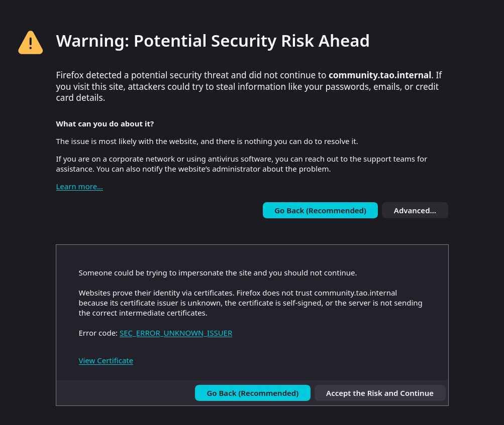

# Prepartion

Depending on your system and browser configuration, *TAO Community Edition* may requires additional step to run successfully.

In this guide, we will check:

* Name resolution for *TAO Community Edition*
* Browser preferences
* Certificate authority warning


## Name resolution

??? info inline end "About name resolution"
    
    Editing `/etc/hosts` is the simpliest method to ensure containers can be addressed with a named host rather than IP address.
    
    For more informations and alternative methods, check [this documentation](../config/network/fqdn.md).

This step is not mandatory, however  *TAO Community Edition* relies on host name resolution for internal routing.

If you deployed *TAO Community Edition* locally on your system using containers, you need to let know your browser that you are hosting such service, and how to find it. Relying on [`hosts` file](https://en.wikipedia.org/wiki/Hosts_(file)) is a well-known method to achieve this.

By default, *TAO Community Edition* uses `community.tao.internal` domain to expose its services. If you are using another domain, you may need to update this domain accordingly in following instructions.

=== "Linux/MacOS"
    Edit `/etc/hosts` and add the following line if missing:

    ```
    0.0.0.0 community.tao.internal
    ```

=== "Windows"

    Edit `C:\Windows\System32\drivers\etc\hosts` and add the following line if missing:

    ```
    0.0.0.0 community.tao.internal
    ```

## Browser preferences

Some security features in modern browsers may alter how *TAO Community Edition* is running.

=== "Mozilla Firefox (version ≥136)"

    `0.0.0.0` resolution

    :   Following a security exploit, Mozilla introduce a new preference to disable `0.0.0.0` resolution.

        This preference has been enforced since version 136 (released in 2025).
    
        You can choose one of the following methods to get *TAO Community Edition* working with Firefox.

        ??? abstract "enable `0.0.0.0` resolution"

            If we keep `0.0.0.0` as resolution address, we may need to adjust this preference:

            1. Open Mozilla Firefox, and browse to [`about:config`](about:config)
            2. You will face a page *Proceed with Caution*, click on `Accept the Risk and Continue`
            3. Look for `network.socket.ip_addr_any.disabled` preference name, and toggle it to `false` (double-click on it)


        ??? abstract "resolve to `127.0.0.1`"

            Instead of resolving to `0.0.0.0`, we can use `127.0.0.1` (`localhost` address). 
        
            However, depending on several internal settings on your system, `127.0.0.1` may eventually be not reachable from your browser.

=== "Google Chrome/Chromium"

    This browser is not known to face issues with its default settings.

    No further configuration is required.


## Certificate warning

Once *TAO Community Edition* is ready, you can open [`https://community.tao.internal/`](https://community.tao.internal/) in your browser.

However, you will certainly face an alert from your browser, warning that Certificate authority is not trusted in your system.

This alert is expected, and you may need to confirm in your browser that you want to continue browsing `community.tao.internal`.


:   ??? question "Is this warning a threat?"

        For a short answer, no.

        It is very common for a local application to use a self-signed certificate authority, which explain the warning from your browser.

        ??? abstract "For a detailled explaination"
            *TAO Community Edition* requires HTTPS communication to support advanced features, and HTTPS protocol relies on trust relationship between server and browser.

            All modern browsers support TLS protocol, which ensure to authentify remote server based on a certificaction chain.

            A certification chain uses a mathematical proof to verify a certificate signature from a trusted autority, and guarantee a server has been granted to declare a particular identity.

            Browsers and systems keep an up-to-date list of trusted authority to verify their signature.

            In our present case, *TAO Community Edition* cannot be verified to be trusted for two reasons:

            - We use a self-signed certificate authority which is by default not known, therefore not trusted by your browser
            - HTTPS server declares itself as `community.tao.internal`, a domain name scoped in `.internal` TLD which is by design not meant to be resolved publically. Without such resolution, its certificate chain cannot be signed by a trusted public certificate authority.

            Failing to verify a trusted signature is not automatically a sign of compromission; it essentially means that your browser has not trusted the certificate authority used by the server, and that it cannot guarantee that you are connected to the server it pretends to be.

:   ??? tip "How to prevent this alert?"

        For more information, and methods to prevent such alert for your users, read [this documentation](../config/network/tls.md).


=== "Mozilla Firefox"

    <div class="grid">
    <div markdown>
    To confirm this alert on Mozilla Firefox

    1. Click on `Advanced...` button
    2. In the section appearing below, click `Accept the Risk and Continue` button
    </div>
    <div markdown>
    
    </div>
    </div>

=== "Google Chrome/Chromium"

    <div class="grid">
    <div markdown>
    To confirm this alert on Google Chrome or Chromium

    1. Click on `Advanced` button
    2. In the section appearing below, click `Proceed to community.tao.internal (unsafe)` link
    </div>
    <div markdown>
    
    </div>
    </div>


## What's next?

- [x] You are almost there! You can now [login and start](./first.md) using *TAO Community Edition*!
- [x] You can also explore [Configuration guide](../config/index.md) and check additional settings.