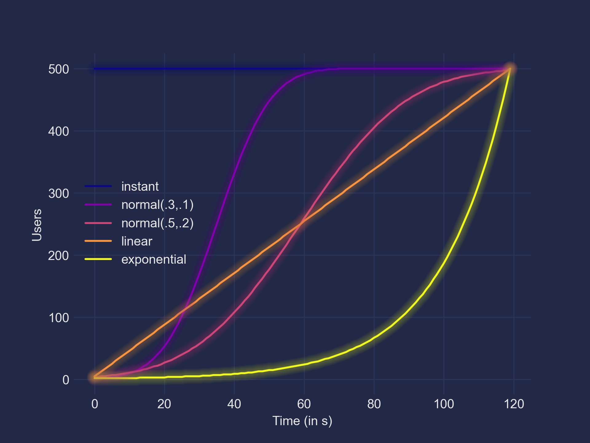

## Benchmark


### Requirements

* Python >=3.14 with `pip`

### Setup

Install `locust` and related dependencies
```sh
make install
```

### Configure


in `config.py`, ensure to match `hydrator` to your user names and passwords
```python
testTakersBank = TAOUserBank(
        bank=range(1,100000),
        hydrator=lambda x: SimpleNamespace(**{
            'username': f'TT{x}',
            'password': 'ChangeMe',
            }),
        )
```

### Run

```
# Load local `venv`
. ./.venv/bin/activate

# Start locust (update -H option with your host)
locust -H https://community.tao.internal --only-summary
```

Then browse to [`http://0.0.0.0:8089`](`http://0.0.0.0:8089`)

### Benchmark

#### Ramp up methods

`linear`
: a uniform set of users is added every second to simulate a linear ramp up

`instant`
: all users are started in the same time

`normal`
: users are added following a normal distribution

`exponential`
: more and more users are added every second until target is reached 

Exemple for 100 users ramp up during 10s

|  time  | instant | normal(.3,.1) | normal(.5,.2) | linear | exponential |
| -----: | ------: | ------------: | ------------: | -----: | ----------: |
|      0 |     100 |             3 |             3 |     10 |           2 |
|      1 |     100 |            16 |             7 |     20 |           3 |
|      2 |     100 |            50 |            16 |     30 |           4 |
|      3 |     100 |            85 |            31 |     40 |           7 |
|      4 |     100 |            98 |            50 |     50 |          10 |
|      5 |     100 |           100 |            70 |     60 |          16 |
|      6 |     100 |           100 |            85 |     70 |          26 |
|      7 |     100 |           100 |            94 |     80 |          40 |
|      8 |     100 |           100 |            98 |     90 |          64 |
|      9 |     100 |           100 |           100 |    100 |         100 |

Exemple for 500 users ramp up during 120s




#### Start benchmarks

* select a load profile (how many users)
* select a ramp up method (see before)
    - for `normal` method, you may need to change `mu_ratio` (how centered we will distribute user) and `sigma` (how flat will be the distribution)
* set a ramp up duration (in seconds)
* select a wait time (how long user will wait between two API actions)
* click `START` to run benchmark